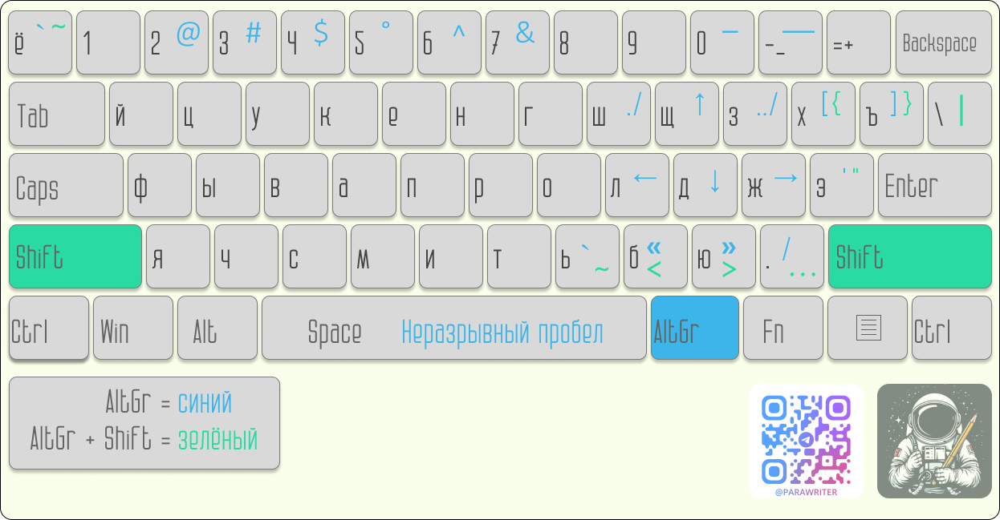
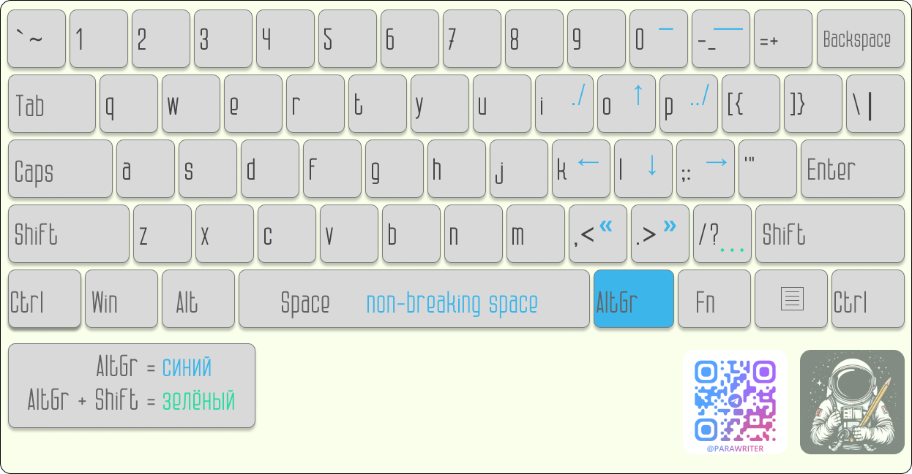

# Раскладка для технической документации

Привет!

Перед вами раскладка для технической документации, которая позволяет вводить нестандартные символы без использования alt-кодов.

Неразрывный пробел, кавычки-ёлочки, стрелочки и другие специальные знаки, которые часто используются при разработке технической документации, размещены на классической клавиатуре. Для набора используются сочетания клавиш **AltGr (правый альт) + клавиша** и **AltGr + Shift + клавиша**. Полный список символов и сочетаний клавиш для их набора приведён в [сопроводительных иллюстрациях](images).

## Информация

Раскладка доступна в двух языках (русский и английский) и может быть установлена на устройства с операционной системой Windows (Windows 10 и Windows 11).

## Установка

1. Скачайте себе на устройство установочные пакеты TW-ru и TW-en.
2. Запустите файлы TW-ru/setup.exe и TW-en/setup.exe.
3. Откройте параметры устройства (**Пуск → Параметры**).
4. Перейдите в раздел **Время и язык → Язык**.
5. В секции «Предпочитаемые языки» выберите «Русский язык» и нажмите кнопку **Параметры**.
6. В секции «Клавиатуры» нажмите кнопку **Добавить клавиатуру** и в открывшемся списке выберите клавиатуру «Раскладка для работы с технической документацией».
7. Удалите старую раскладку: выделите её в секции «Клавиатуры» и нажмите кнопку **Удалить**.
8. Вернитесь в раздел **Время и язык → Язык** и повторите действия 5-7 для английского языка.

>NB! Если в разделе **Время и язык → Язык** нет нужного языка, сначала добавьте язык в секцию «Предпочитаемые языки» а затем настройте для него клавиатуру.

## Использование

При правильной настройке раскладки TW-ru и TW-en заменят собой стандартные RU и EN раскладки. Для переключения между языками используйте языковую панель или настроенное в вашей системе сочетание клавиш.
Для набора специальных символов используйте сочетания клавиш **AltGr (правый альт) + клавиша** и **AltGr + Shift + клавиша**.

Если до этого вы не пользовались кастомными раскладками, в первое время у вас могут возникнуть трудности с набором специальных символов. Мы постарались разместить их так, чтобы ваши руки оставались в удобной естественной позиции на клавиатуре. В русском варианте символы с английской классической раскладки (например, квадратные и фигурные скобки, обратная кавычка, тильда) размещены на своих клавишах.

>NB! Не забывайте, что AltGr — это только правый Alt! Комбинации с левым Alt работать не будут.

## Обратная связь

Мы будем рады получить от вас обратную связь:

1. Через issue в [репозитории проекта](https://github.com/novillero/tech-layout/issues).
2. В телеграм канале [Parawriter](https://t.me/parawriter) (личные контакты в описании канала).
